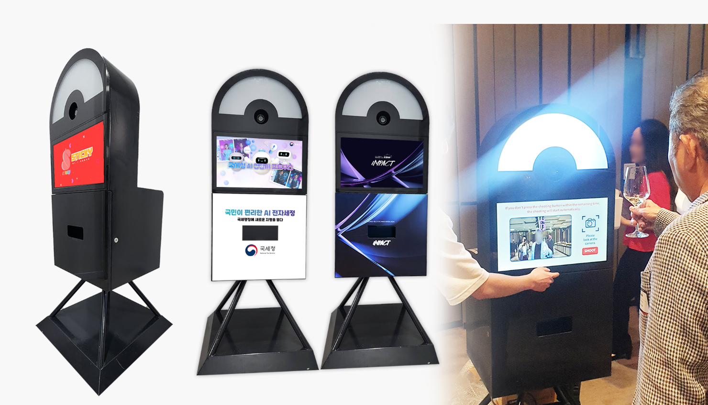
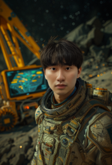
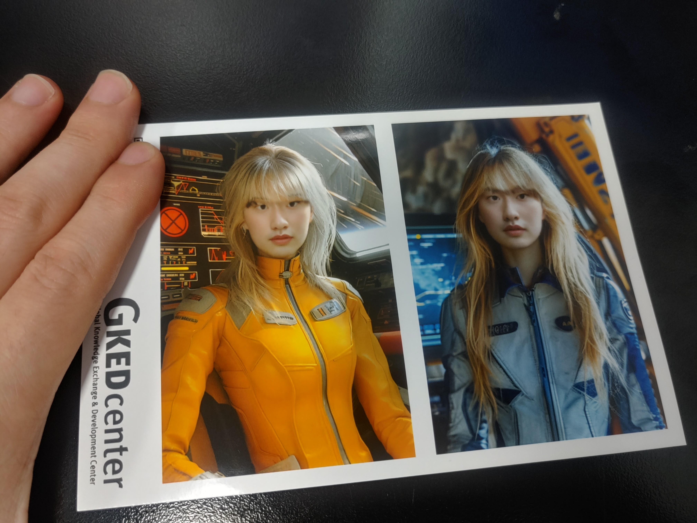
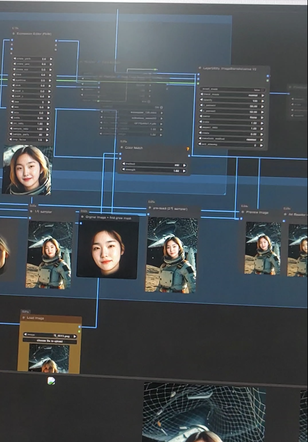
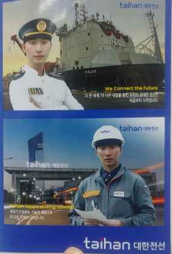
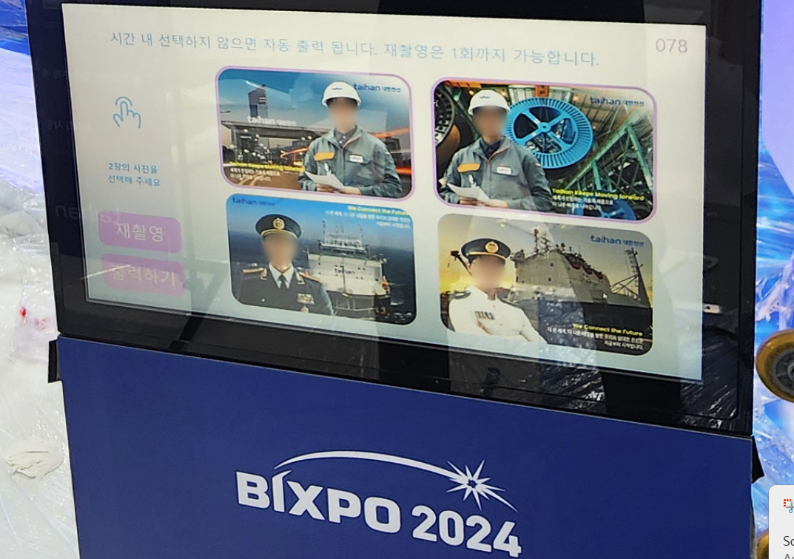
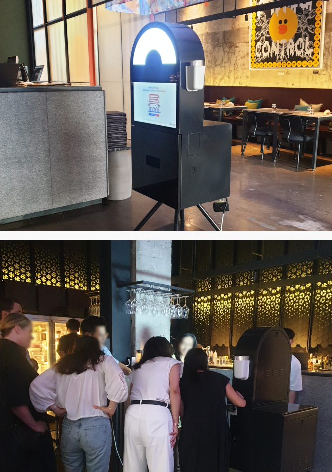
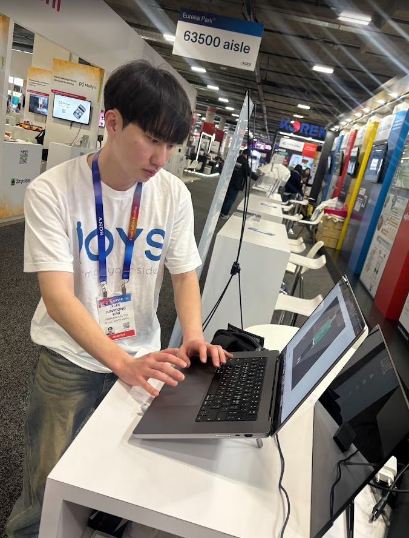
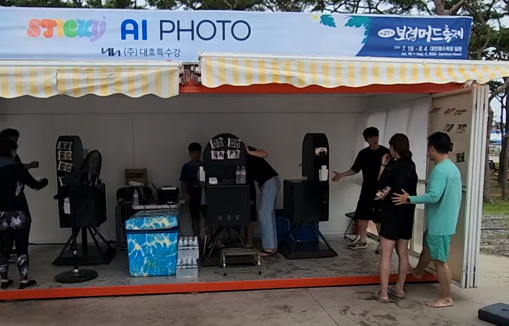

# AI Project Portfolio

## 🚀 Project Workflow (Creative Team)

**Client Consultation → Template Image Creation & Initial Draft Delivery → Client Feedback & Revisions → Error Testing & Template Stabilization → Front-end/Back-end Modification & Kiosk Software Installation → Kiosk Testing & Final Delivery**

---

## 📌 Key Contributions

### 🌐 Global Knowledge Collaboration

* **Role:** Project Manager
* Defined and aligned project direction with client.
* Developed customized categories.
* Conducted rigorous template error testing and stabilization.

**Highlights:**

* **Large-scale permanent AI photo booth installation** (Contract Value: \~20 million KRW)
* Developed diverse categories across **Future Medical, Factory Automation, Maritime Logistics**.
* Managed extensive client-driven revisions effectively.
  
<table>
  <tr>
    <td></td>
    <td></td>
    <td></td>
  </tr>
</table>

---

### 🏢 Taihan Cable & Solution

* **Role:** Project Manager
* Defined and implemented project direction.
* Created customized template categories.
* Ensured template error testing and stabilization.

<table>
  <tr>
    <td></td>
    <td></td>
  </tr>
</table>

[📸 On-site Event Photos](https://www.myaiphoto.co.kr/Event_Gallery/?q=YToyOntzOjEyOiJrZXl3b3JkX3R5cGUiO3M6MzoiYWxsIjtzOjQ6InBhZ2UiO2k6MTt9&bmode=view&idx=126508956&t=board)

---

### 🛠️ ASML Holding

* **Role:** Project Manager
* Defined project objectives based on client input.
* Developed tailored image categories.
* Conducted template testing and ensured stability.

*Photos unavailable (client confidentiality)*

---

### 🌐 Google Korea

* Created and delivered initial AI image drafts.
* On-site kiosk installation and operation.
  

[📸 Event Photos](https://www.myaiphoto.co.kr/Event_Gallery/?q=YToyOntzOjEyOiJrZXl3b3JkX3R5cGUiO3M6MzoiYWxsIjtzOjQ6InBhZ2UiO2k6Mjt9&bmode=view&idx=68224321&t=board)

---

### 🎟️ CES 2025

* Exhibitor participation, introducing innovative AI fashion solutions.

<table>
  <tr>
    <td></td>
    <td></td>
  </tr>
</table>

[📸 Event Photos](https://photos.app.goo.gl/z5t9KQiFrW9KLD4r6)

---

### 🍺 OB Beer – Budweiser Online Campaign

* Generated AI-based images for digital marketing campaign.
* Performed preprocessing and template stabilization.

[📸 Campaign Overview](https://www.myaiphoto.co.kr/Event_Gallery/?q=YToyOntzOjEyOiJrZXl3b3JkX3R5cGUiO3M6MzoiYWxsIjtzOjQ6InBhZ2UiO2k6Mjt9&bmode=view&idx=28262635&t=board)

---

### 🧒 National Kindergarten Dream Booth (Job Concept)

* Developed **18 job-themed categories** (9 male, 9 female).
* Conducted comprehensive testing, stabilization, and preprocessing.
* Installed kiosk software.

<table>
  <tr>
    <td></td>
    <td></td>
    <td></td>
  </tr>
</table>  

[📸 Event Photos](https://www.myaiphoto.co.kr/Event_Gallery/?q=YToyOntzOjEyOiJrZXl3b3JkX3R5cGUiO3M6MzoiYWxsIjtzOjQ6InBhZ2UiO2k6MTt9&bmode=view&idx=123036653&t=board)

---

### 🌊 Boryeong Mud Festival

* Generated AI-driven event images.
* Conducted preprocessing, template stabilization, and kiosk installation.

[📸 Event Photos](https://www.myaiphoto.co.kr/Event_Gallery/?q=YToyOntzOjEyOiJrZXl3b3JkX3R5cGUiO3M6MzoiYWxsIjtzOjQ6InBhZ2UiO2k6Mjt9&bmode=view&idx=68206037&t=board)

---

### 🗼 N Seoul Tower

* Delivered and installed kiosk.
* Stabilized image templates.

---

### 🇸🇬 Singapore Chamber of Commerce in Korea

* Conducted on-site kiosk installation and support.

---

### 🇯🇵 Korea Tourism Organization – Fukuoka Branch

* On-site participation and kiosk operations in Fukuoka, Japan.

---

### 🎬 Korea Creator Media Awards

* On-site participation and installation of AI kiosk solutions.

[📸 Event Photos](https://www.myaiphoto.co.kr/Event_Gallery/?q=YToyOntzOjEyOiJrZXl3b3JkX3R5cGUiO3M6MzoiYWxsIjtzOjQ6InBhZ2UiO2k6Mjt9&bmode=view&idx=93038711&t=board)

---

## 📫 Contact

For further details or inquiries, please reach out via [Email](junyeong6780@gmail.com).

---

*This README reflects detailed documentation and achievements from multiple successful AI-driven projects.*
